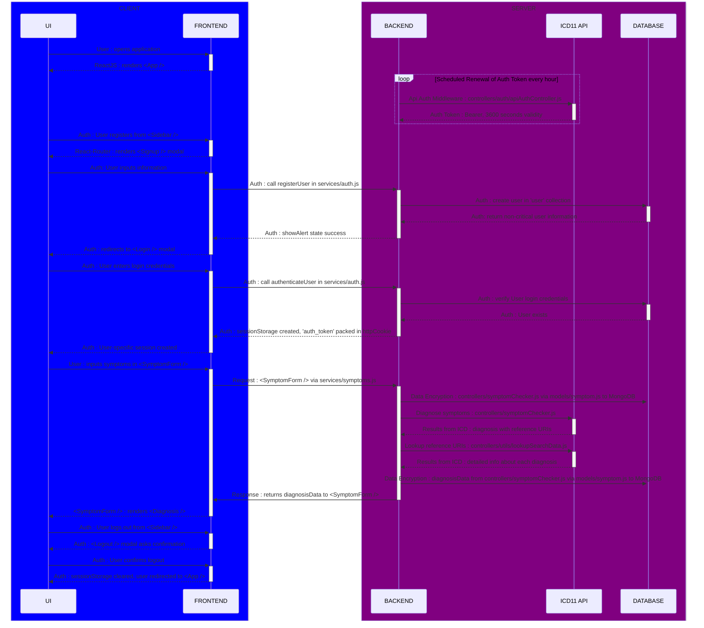

# Overview
- This file contains the README documentation for the Symptom Checker backend project.
 
- The Symptom Checker backend project is the server-side application which handles the ICD API authentication, access and data processing and generating relevant output for the symptoms passed down from the frontend API (`axios`).

- Prototype, plan and implementation of the Symptom Checker application are defined in the [prototype README](https://github.com/prak112/ICD11-SymptomChecker#oveview)
- Tools and Technologies used : 
    - `express`
    - `node`

## Workflow
<!-- TO DO: 
use alt, opt - https://mermaid.js.org/syntax/sequenceDiagram.html#alt
1. valid, invalid Signup
2. valid, invalid Login
3. valid, invalid symptoms
use links/drop menu - https://mermaid.js.org/syntax/sequenceDiagram.html#actor-menus
1. for Frontend, Backend repos key directories
2. for Database schema
3. for ICD11 API authentication controller
4. to seperate frontend and backend workflow by hyperlinking Workflow in README
use styling - https://mermaid.js.org/syntax/sequenceDiagram.html#styling
1. style header texts - CLIENT, SERVER
2. style components
3. style interactions (for visibility)
 -->


<hr>
<br>

# Usage
- Make sure you have `node`(v`20.11.0`) and `npm`(v`10.5.0`) installed on your machine before running these commands.

- Clone the project
```bash
    git clone https://github.com/prak112/Symptom-Checker-backend.git
```

- Install dependencies using `npm`
```bash
    cd Symptom-Checker-backend/symptom-checker-backend
    npm install
```

- Run the development server
```bash
    npm run dev
``` 