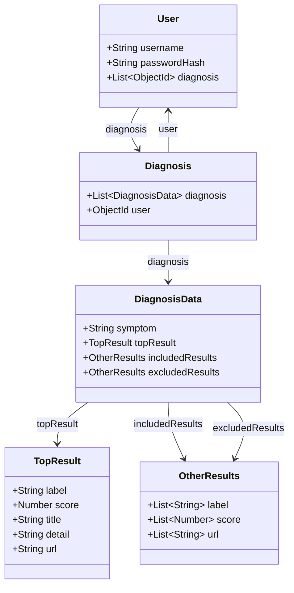

# Overview
- This file contains the README documentation for the Symptom Checker backend project.
 
- The Symptom Checker backend project is the server-side application which handles the ICD API authentication, access and data processing and generating relevant output for the symptoms passed down from the frontend API (`axios`).

- Prototype, plan and implementation of the Symptom Checker application are defined in the [prototype README](https://github.com/prak112/ICD11-SymptomChecker#oveview)
- Tools and Technologies used : 
    - `express`
    - `node`

## Workflow
- All diagrams rendered using *Mermaid*
- Refer [Frontend Workflow](https://github.com/prak112/Symptom-Checker-frontend#workflow)

- Database Schema represented in Class Diagram



<hr>

- Backend Workflows represented in Sequence Diagram

    ```mermaid
    sequenceDiagram
        box Blue CLIENT
        participant FRONTEND
        end

        box Purple SERVER
        participant BACKEND
        participant ICD11 API
        participant DATABASE
        end

        critical Establish Database connection
            BACKEND-->DATABASE: Mongoose ODM connects to MongoDB
        option Network Timeout
            BACKEND-->BACKEND: Log Timeout Error
        option MongoDB Error
            BACKEND-->BACKEND: Log Validation Error
        end
        critical Authorize ICD API Access
            loop Scheduled Renewal of Auth Token every hour
                BACKEND->>+ICD11 API: Auth Controller : POST /token-endpoint/client-credentials
                ICD11 API-->>-BACKEND: Auth Token : Bearer, 3600 seconds validity
            end
        option Network Timeout
            BACKEND-->BACKEND: Log Timeout Error
        option API Error
            BACKEND-->BACKEND: Log Server Error    
        end

        alt Valid Registration
            Note over FRONTEND: <Signup /> validation - PASSED
            FRONTEND->>+BACKEND: Auth Service : POST /public/auth/signup
            Note over BACKEND, DATABASE: Backend-Database validation - PASSED        
            BACKEND-->+DATABASE: Auth Controller : User Information {username: '', passwordHash: ''}
            DATABASE-->>-BACKEND: Database Server : User {username: '', symptom: [] }
            BACKEND-->>-FRONTEND: Auth Controller : return User {username: '', symptom: []}
            Note over FRONTEND: <AlertProvider /> state success
        else Backend-Database Validation Error
            Note over FRONTEND: <Signup /> validation - PASSED
            FRONTEND->>+BACKEND: Auth Service : POST /public/auth/signup
            Note over BACKEND, DATABASE: Backend-Database validation - FAILED
            BACKEND-->>-FRONTEND: Auth Controller : ErrorHandler forwards response
            Note over FRONTEND: Display error notification
        end
        alt Valid Login
            Note over FRONTEND: <Login /> validation - PASSED
            FRONTEND->>+BACKEND: Auth Service : POST /public/auth/login
            BACKEND->>+DATABASE: Auth Controller : verify User login credentials
            DATABASE-->>-BACKEND: Database Server : User exists
            Note over BACKEND, DATABASE: Backend-Database validation - PASSED
            BACKEND-->>-FRONTEND: Auth Controller : sessionStorage created<br>'auth_token' packed in Request Header
            Note over FRONTEND: <AlertProvider /> state success
        else Backend-Database Validation Error
            Note over FRONTEND: <Login /> validation - PASSED
            FRONTEND->>+BACKEND: Auth Service : POST /public/auth/login
            BACKEND->>+DATABASE: Auth Controller : verify User Information {username: '', password: ''}
            DATABASE-->>-BACKEND: Auth Controller : User does not exist
            Note over BACKEND, DATABASE: Backend-Database validation - FAILED
            BACKEND-->>-FRONTEND: Auth Controller : ErrorHandler forwards response
            Note over FRONTEND: Display error notification
        end

        alt General Symptoms search
            Note over FRONTEND: <SymptomForm /> validation - PASSED
            FRONTEND->>+BACKEND: POST /api/protected/symptoms/general
        Note over BACKEND: Sanitize and Validate User input
            loop Search request for each symptom  
                BACKEND->>+ICD11 API: SymptomChecker Controller : GET /icd/release/11/2024-01/mms/search
                ICD11 API-->>-BACKEND: External Server : multiple search results {}<br> {'label': [''], 'score': [''], 'foundationUri': ['']}
                loop Lookup request for each foundationUri 
                    BACKEND->>+ICD11 API: SymptomChecker Controller : GET /icd/release/11/2024-01/mms/lookup 
                    ICD11 API-->>-BACKEND: External Server : lookup results {}<br>locate {'title': '', 'definition': '', 'browserUrl': ''}
                end
            end
            BACKEND-->>-FRONTEND: SymptomChecker Controller: diagnosisData {'topResult': {}, 'includedResults': {}, 'excludedResults': {}}
            par
                BACKEND->>+DATABASE: SymptomChecker Controller : encrypt and store symptoms, diagnosisData
            and
                Note over FRONTEND: <SymptomForm /> render diagnosisData
            end

        else Specific Symptoms search
            Note over FRONTEND: <SymptomForm /> validation - PASSED
            FRONTEND->>+BACKEND: POST /api/protected/symptoms/specific
        Note over BACKEND: Sanitize and Validate User input 
            loop GET request for each symptom   
                BACKEND->>+ICD11 API: SymptomChecker Controller : GET /icd/release/11/2024-01/mms/autocode
                ICD11 API-->>-BACKEND: External Server : single search result {}<br>locate {'label': '', 'score': '', 'foundationUri': ''} 
                BACKEND->>+ICD11 API: SymptomChecker Controller : GET /icd/release/11/2024-01/mms/lookup 
                ICD11 API-->>-BACKEND: External Server : lookup results {}<br>locate {'title': '', 'definition': '', 'browserUrl': ''}
            end
            BACKEND-->>-FRONTEND: SymptomChecker Controller: diagnosisData {'topResult': {}, 'includedResults': {}, 'excludedResults': {}}
            par
                BACKEND->>+DATABASE: SymptomChecker Controller : encrypt and store symptoms, diagnosisData
            and
                Note over FRONTEND: <SymptomForm /> render diagnosisData
            end
        end
    ```

<hr>
<br>

# Usage
- Make sure you have `node`(v`20.11.0`) and `npm`(v`10.5.0`) installed on your machine before running these commands.

- Clone the project
```bash
    git clone https://github.com/prak112/Symptom-Checker-backend.git
```

- Install dependencies using `npm`
```bash
    cd Symptom-Checker-backend/symptom-checker-backend
    npm install
```

- Run the development server
```bash
    npm run dev
``` 

<hr>
<br>

# Credits
- **Coding Assistants** : 
    - GitHub Copilot
    - Pieces Copilot
- **Documentation Tool** : Mermaid

<hr>
<hr>
